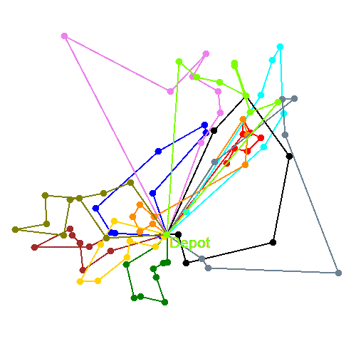

# IP6 - Vehicle routing problem with time windows (IRuettae)


This project contains several approaches to solve a modified version of the vehicle routing problem with time windows. 

This project was developed as a bachelor thesis at the [FHNW](https://fhnw.ch) by [P. Lüscher](https://github.com/Isitar) and [J. Meyer](https://github.com/StrelokCH)


## Directory structure
The project sourcecode is located inside the IRuettae folder.
```
Api/             an ASP.NET Web Api, used as backend to start route calculations
Converter/       libraries to convert the database entities into solver models
Core/            several solvers to solve the problem and the definition for solver models
Database/        persistence related code
DataEnrichment/  libraries to enrich the database models, e.g. geocoding
DebugApps/       several apps used to speed up development and to evaluate solvers
Frontend/        an ASP.NET MVC project, used as frontend for the api
```

## Solvers
A brief overview on all approaches
### Genetic algorithm
A fully functional genetic algorithm, completely custom written for this problem.

### Google routing
Uses the google or tools to solve the problem instance.

### ILP
An ilp (integer linear programming) formulation using the SCIP solver through Google OR Tools. This project was developed as ip5.

### ILP2
An improved ilp formulation, using Gurobi as solver. This model is a complete formulation of the problem.

### ILPIp5Gurobi
The ILP project ported to Gurobi.

### LocalSolver
A model formulation for LocalSolver. The best and fastest approach discovered for this problem.

### Manual
Used for debugging purpose, creating a manual route result